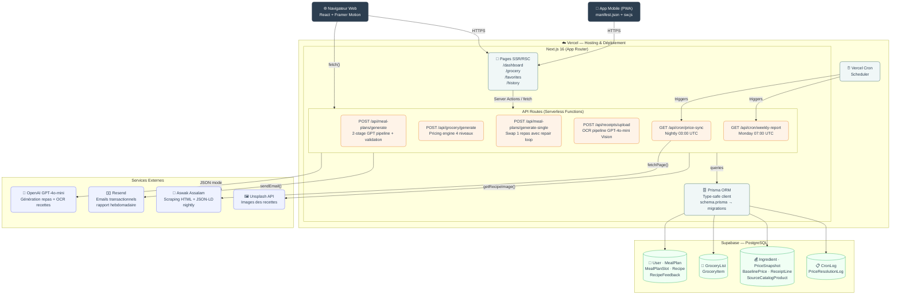
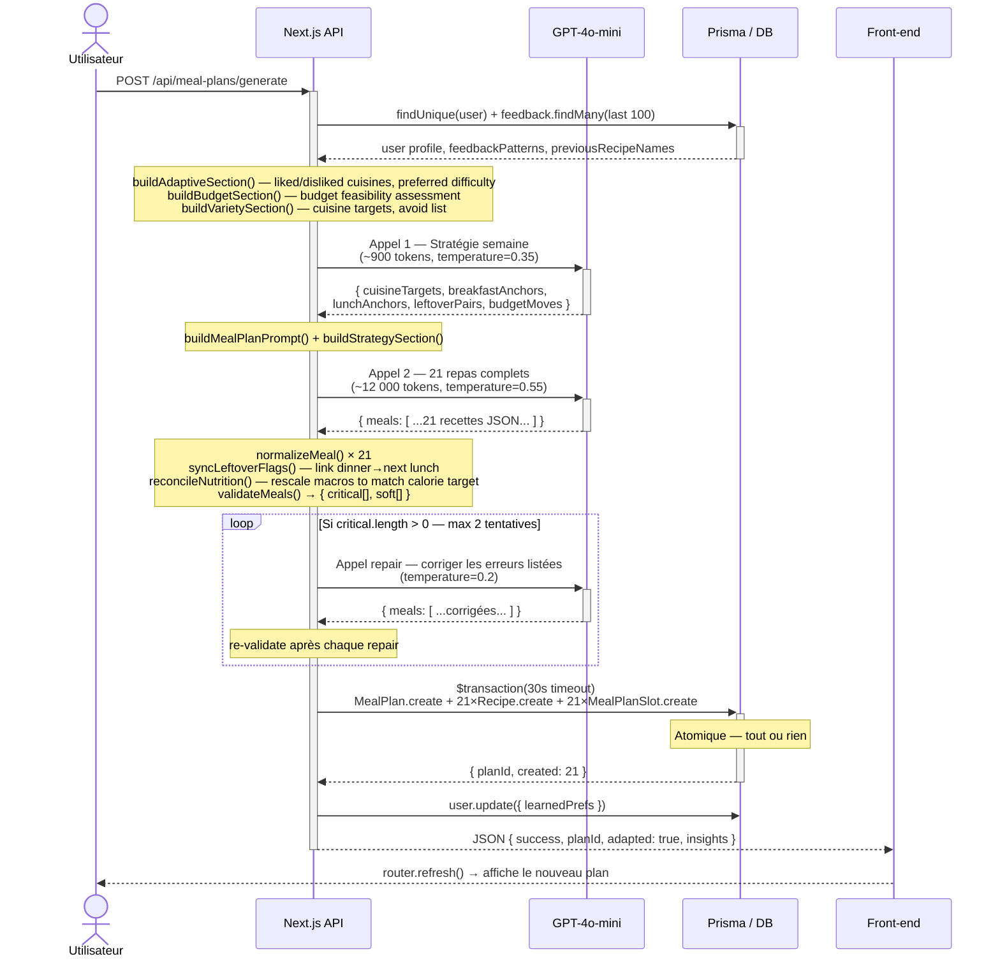
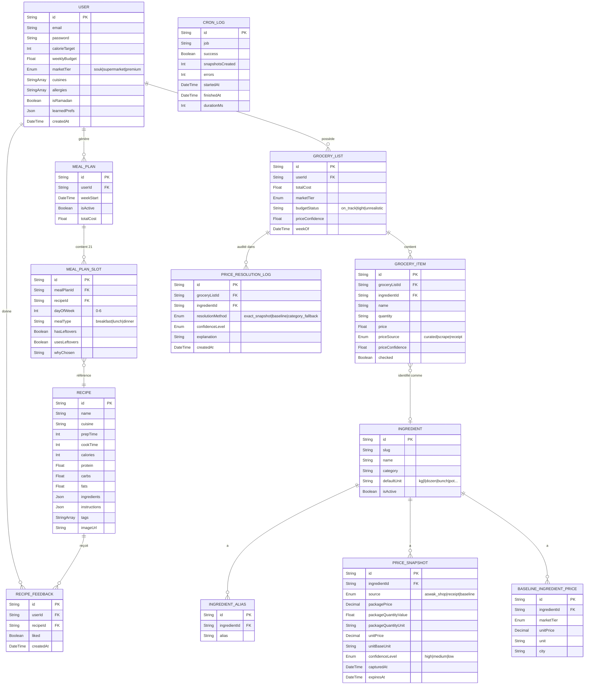
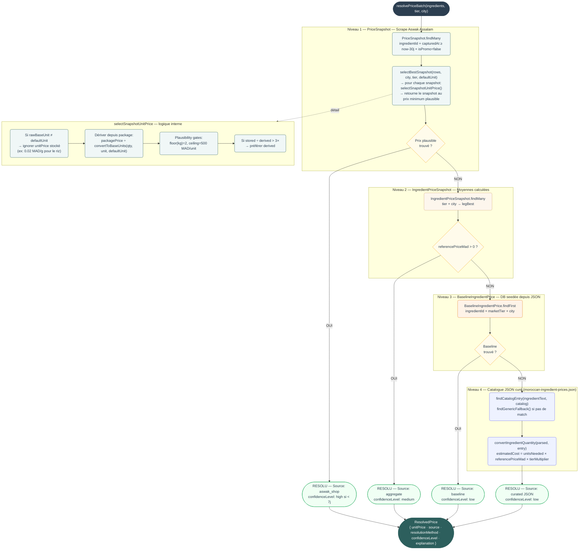

# Soufra — Thesis Diagrams

> **How to preview in VS Code:**
> Open this file → `Ctrl+Shift+P` → `Markdown: Open Preview to the Side`
> All 4 diagrams render in the preview panel.
>
> **To export as PNG/SVG:** Right-click on a diagram in preview → Save Image
> Or use the Mermaid extension's export button.

---

## 1. Architecture Système

---

## 2. Diagramme de Séquence — Génération du Plan Repas

---

## 3. Diagramme Entité-Relation (simplifié)

---

## 4. Pipeline de Résolution des Prix (4 niveaux)

---

## Comment exporter ces diagrammes

Pour intégrer dans ton rapport Word/LaTeX :

1. **Dans VS Code** : Ouvre ce fichier → `Ctrl+Shift+P` → `Markdown: Open Preview to the Side`
2. **Clic droit sur le diagramme** dans le preview → `Copy Image` ou `Save Image As`
3. Colle directement dans Word

Ou utilise [mermaid.live](https://mermaid.live) — colle le code Mermaid, télécharge en PNG/SVG haute résolution.
